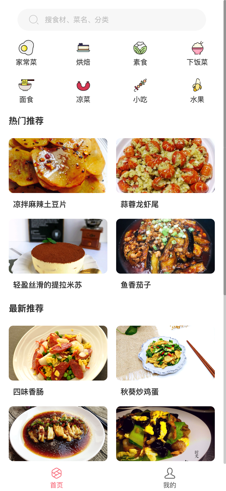
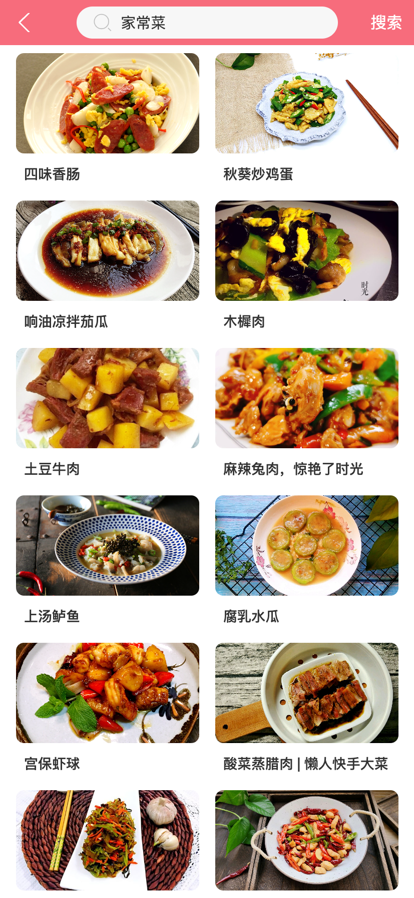
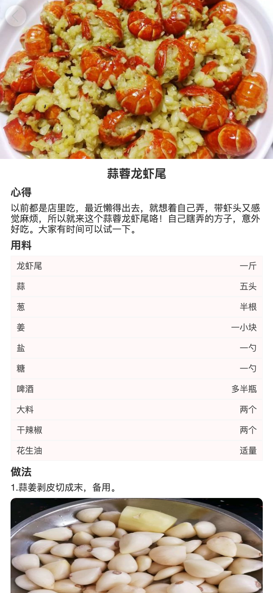

## 基于React开发菜谱项目
利用业余时间学习React hooks，基于React+antd-mobile开发菜谱。主要用来搭建框架，熟悉React、react-router和antd-mobile组件，demo展示页面

<br/>

## 安装依赖包
```
npm install
```

### 本地运行
```
npm run start
```

### 打包
```
npm run build
```

### 技术栈

 - react
 - antd-mobile
 - react-router
 - react-redux
 - ES6
 - Sass

### 项目目录结构

assets----存储静态图片资源和共用icon图标<br/>
components----存储共用组件<br/>
route----路由配置<br/>
store/store----react-redux<br/>
styles----全局样式<br/>
utils----工具函数<br/>
<br/>

### 在线预览（手机扫码效果更佳）


### 项目截图





<br/>

### 最后
写该demo的目的主要是熟悉react相关技术，不足之处，敬请见谅
<br/>